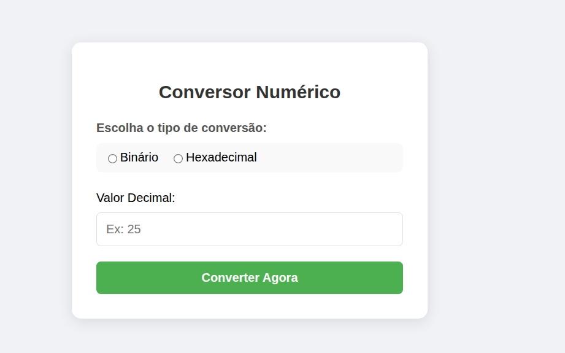
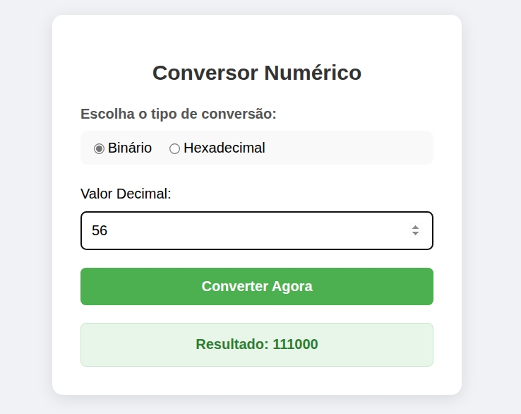
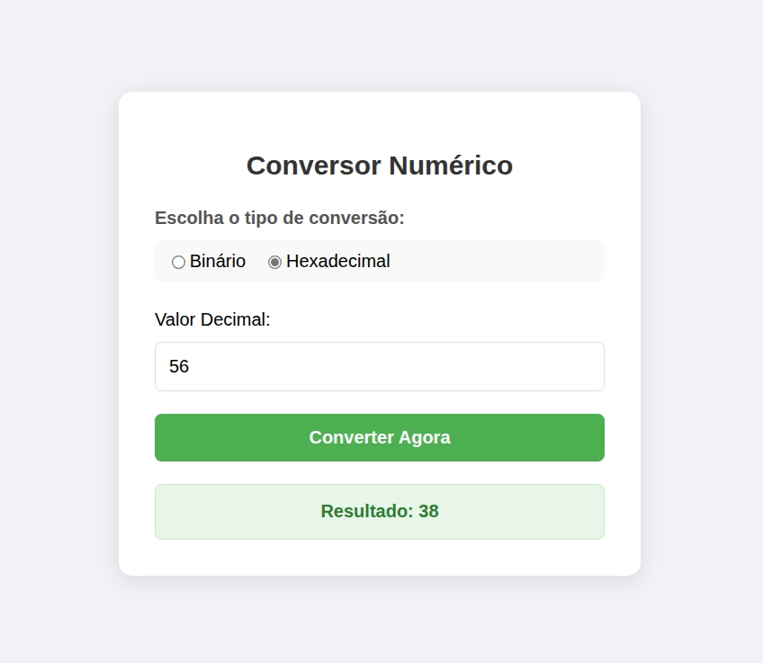

# 🔢 Conversor de Decimal para Binário e Hexadecimal

Um conversor numérico simples, elegante e funcional desenvolvido em **PHP**, **HTML5** e **CSS3**. Este projeto transforma números inteiros decimais em suas representações nas bases **Binária** e **Hexadecimal** utilizando algoritmos manuais de conversão.

## Funcionalidades

-   **Conversão para Binário:** Transforma números decimais em sequências de 0s e 1s.
-   **Conversão para Hexadecimal:** Transforma números decimais em base 16 (0-9, A-F).
-   **Interface Responsiva:** Design moderno que se adapta a dispositivos móveis e desktops.
-   **Validação de Dados:** Verifica se os campos foram preenchidos antes de realizar o cálculo.

## Tecnologias Utilizadas

-   **PHP 8+**: Lógica de processamento e algoritmos de conversão.
-   **HTML5**: Estrutura do formulário e interface.
-   **CSS3**: Estilização moderna (Flexbox, sombras, arredondamentos).

## Como funciona a lógica?

Diferente de usar funções prontas do PHP (como `decbin()` ou `dechex()`), este projeto utiliza algoritmos de **divisões sucessivas**:
1.  O número decimal é dividido pela base desejada (2 ou 16).
2. O resto da divisão é concatenada com uma variável e amazenada na mesma. 
3. No caso do hexadicmal segue o mesmo processo, mas com um detalhe a mais. O resto da divisão é usada para pegar um caractere numa String (de acordo com o índice) e concatená-la numa variável e amazenar o resultado na mesma.
4. O número é divido pela base (2 ou 16) e o valor é atualizado.
5. E o processo se repete até chegar ao número 0.

## Pré-requisitos

Para rodar este projeto localmente, você precisará de um servidor PHP instalado:
* [XAMPP](https://www.apachefriends.org/pt_br/index.html)
* [WampServer](https://www.wampserver.com/)
* Ou o servidor embutido do próprio PHP.

## Como Rodar o Projeto

1.  Clone este repositório ou baixe o arquivo `.php`.
2.  Coloque o arquivo na pasta raiz do seu servidor local (ex: `htdocs` no XAMPP).
3.  Inicie o servidor Apache.
4.  Abra o navegador e acesse:
    ```
    http://localhost/nome-do-seu-arquivo.php
    ```

## Demonstração da Interface

> 
> 
> 


> A interface utiliza um esquema de cores limpo, com botões de rádio estilizados e caixas de alerta verdes para resultados e vermelhas para erros de preenchimento.

---
Desenvolvido para fins de estudo sobre lógica de programação e integração Front/Back-end.
